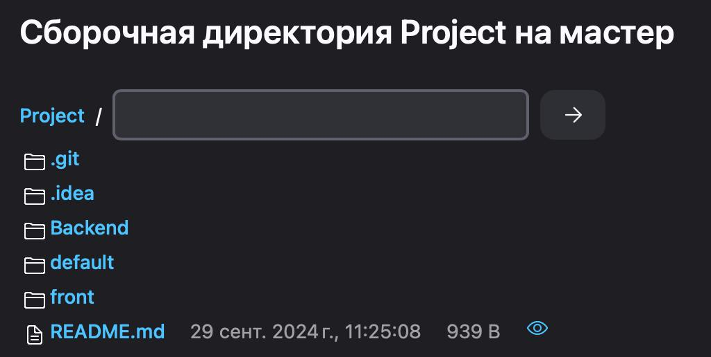
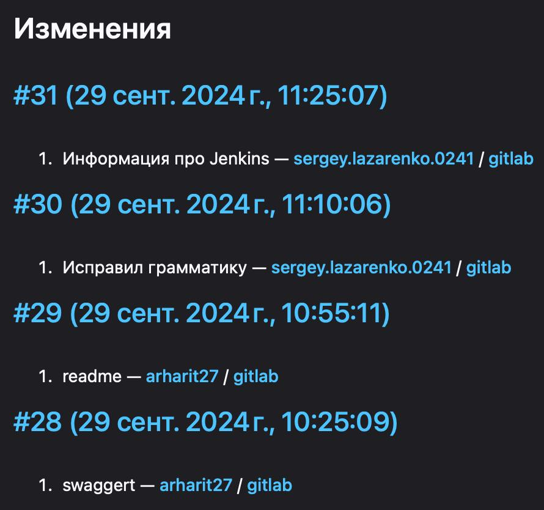
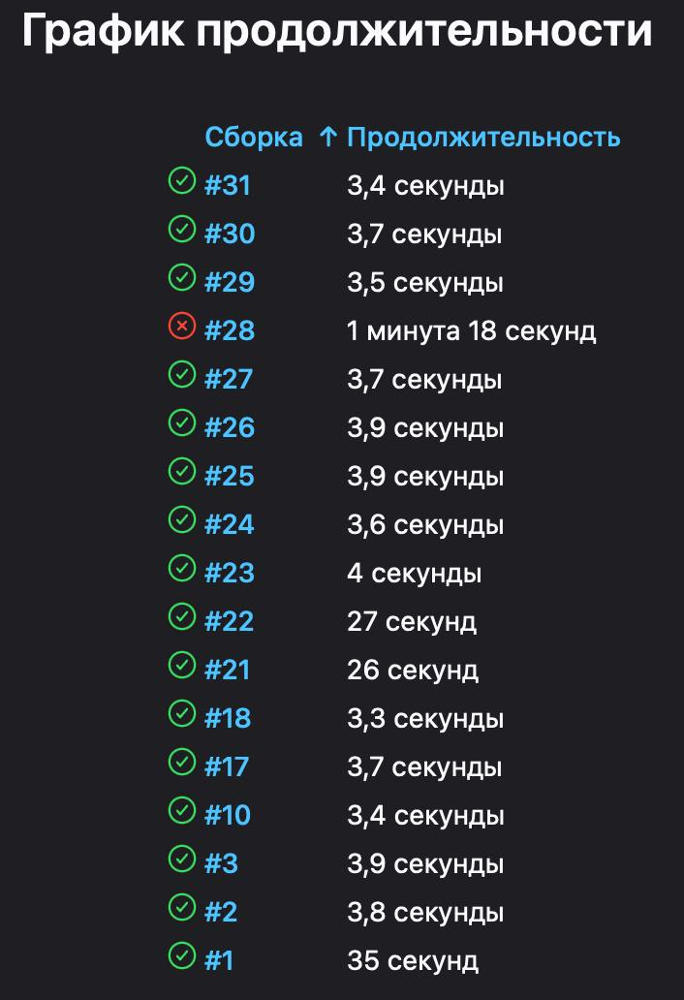

# Getting Started with Create React App

This project was bootstrapped with [Create React App](https://github.com/facebook/create-react-app).

# Dependiences

- npm in path
- make in path
- docker

# Available Scripts

## Frontend directory

### `npm install`

Установка зависимостей

### `npm start`

Запуск сервера на localhost:3000

## Backend directory

### `make`

Запуск и сборка сервера на localhost:8080

### `make down`

Остановка сервера

### `make logs`

Вывод логов приложения

## Swagger

Сваггер доступун на localhost:8080/swagger


## Jenkins

Запуск  Jenkins с использованием установленного JDK:
```
 /opt/homebrew/opt/openjdk@21/bin/java -Dmail.smtp.starttls.enable=true -jar /opt/homebrew/opt/jenkins-lts/libexec/jenkins.war --httpListenAddress=127.0.0.1 --httpPort=8082
```

Подключение Jenkis к репозиторию, после настройки происходит сборка проекта через определенный промежуток времени и при commit изменениях:





